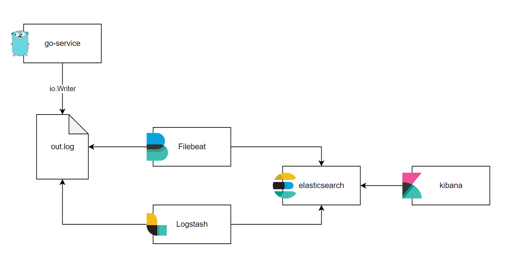
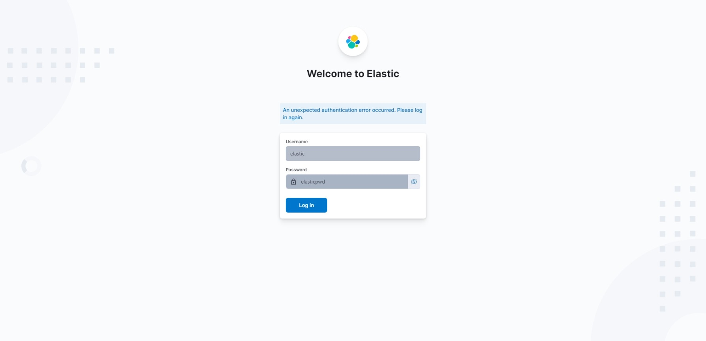
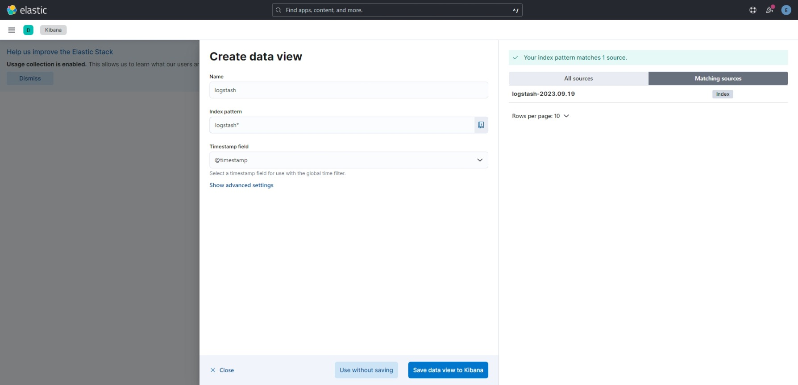
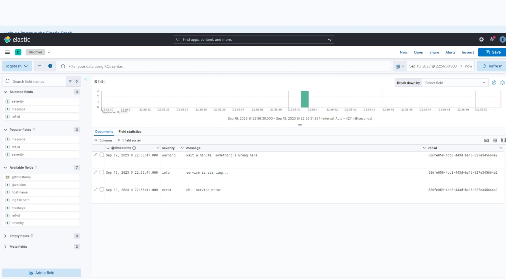
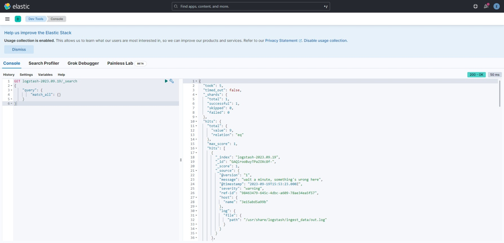

# Log Monitoring with ELK Stack

## How it work


## How to run
1. Start ELK Stack with docker-compose
```
cd elk-stack
docker-compose up -d
```
2. Go to Kibnana at [localhost:5601](loaclhost:5601)



3. Run go-service for create log
```
go run main.go
{"@timestamp":"2023-09-19T22:53:23+07:00","message":"service is starting...","ref-id":"98463479-645c-4dbc-a609-78ae34ea5f57","severity":"info"}
{"@timestamp":"2023-09-19T22:53:23+07:00","message":"wait a minute, something's wrong here","ref-id":"98463479-645c-4dbc-a609-78ae34ea5f57","severity":"warning"}
{"@timestamp":"2023-09-19T22:53:23+07:00","message":"oh!! service error","ref-id":"98463479-645c-4dbc-a609-78ae34ea5f57","severity":"error"}
```

4. Go to [Discovery](http://localhost:5601/app/discover#/) and Create data view


5. Select fields and use KQL for searching logs


6. You can check document in index at [Dev Tools](http://localhost:5601/app/dev_tools)


Query:
```
GET logstash-2023.09.19/_search
{
    "query": {
        "match_all": {}
    }
}
```

Result:
```json
{
  "took": 3,
  "timed_out": false,
  "_shards": {
    "total": 1,
    "successful": 1,
    "skipped": 0,
    "failed": 0
  },
  "hits": {
    "total": {
      "value": 3,
      "relation": "eq"
    },
    "max_score": 1,
    "hits": [
      {
        "_index": "logstash-2023.09.19",
        "_id": "GAQlrooBwyTPaZOXc8f-",
        "_score": 1,
        "_source": {
          "@version": "1",
          "message": "wait a minute, something's wrong here",
          "@timestamp": "2023-09-19T15:53:23.000Z",
          "severity": "warning",
          "ref-id": "98463479-645c-4dbc-a609-78ae34ea5f57",
          "host": {
            "name": "3e15abd5a99b"
          },
          "log": {
            "file": {
              "path": "/usr/share/logstash/ingest_data/out.log"
            }
          }
        }
      },
      {
        "_index": "logstash-2023.09.19",
        "_id": "GQQlrooBwyTPaZOXc8f-",
        "_score": 1,
        "_source": {
          "@version": "1",
          "message": "oh!! service error",
          "@timestamp": "2023-09-19T15:53:23.000Z",
          "severity": "error",
          "ref-id": "98463479-645c-4dbc-a609-78ae34ea5f57",
          "host": {
            "name": "3e15abd5a99b"
          },
          "log": {
            "file": {
              "path": "/usr/share/logstash/ingest_data/out.log"
            }
          }
        }
      },
      {
        "_index": "logstash-2023.09.19",
        "_id": "GgQlrooBwyTPaZOXc8f_",
        "_score": 1,
        "_source": {
          "@version": "1",
          "message": "service is starting...",
          "@timestamp": "2023-09-19T15:53:23.000Z",
          "severity": "info",
          "ref-id": "98463479-645c-4dbc-a609-78ae34ea5f57",
          "host": {
            "name": "3e15abd5a99b"
          },
          "log": {
            "file": {
              "path": "/usr/share/logstash/ingest_data/out.log"
            }
          }
        }
      }
    ]
  }
}
```